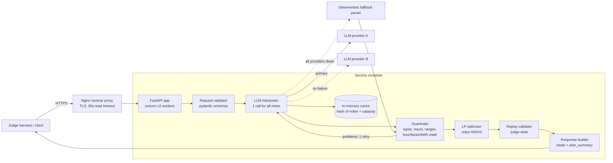
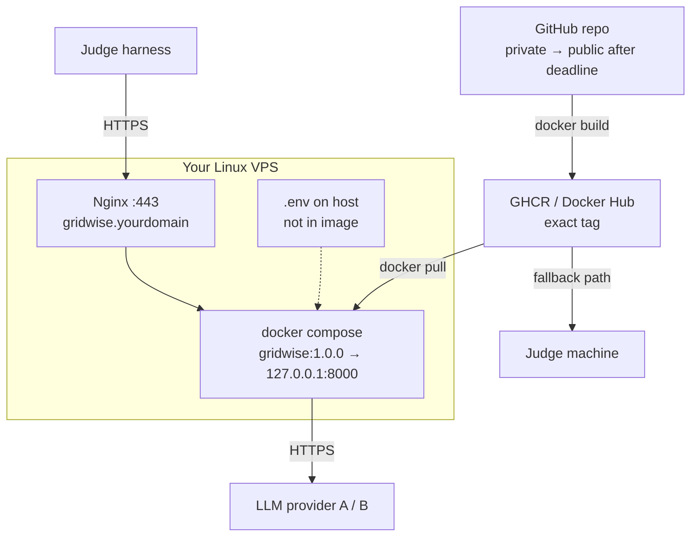

# 02 · System Architecture

## 1. Principle

> The LLM understands language. Deterministic code validates and does arithmetic. The solver does the scheduling. A replay validator proves the result before it leaves the service.

## 2. Component view



## 3. Components and responsibilities

| Component | File | Responsibility | Trust level of its output |
|---|---|---|---|
| API layer | `app/main.py` | Routing, manual JSON parse (400), status codes, generic error bodies | — |
| Request validator | `app/schemas.py` | 24 unique hours 0–23, 1–3 non-empty notes, finite non-negative numbers, `min ≤ initial ≤ capacity` | trusted |
| LLM interpreter | `app/interpreter.py` | Prompt, provider chain, timeout, retry with guardrail feedback, cache | **untrusted** |
| Guardrails | `app/guardrails.py` | Enum check, note mapping, build `hours`, compute `factor` / kWh, range checks, downgrade to `no_op` | trusted |
| Optimizer | `app/optimizer.py` | Directives → bounds → LP → rounded plan + totals | trusted |
| Replay validator | `app/validator.py` | Hour-by-hour re-check of every rule and directive | gate |
| Fallback parser | `app/fallback.py` | Keeps the service answering 200 when every LLM is down | labelled in `explanation` |

## 4. Data contracts

### 4.1 LLM intermediate format (internal, never returned to the client)

```json
{"items": [
  {"note_index": 0, "directive_type": "solar_reduction",
   "start_hour": 11, "end_hour": 14,
   "value": 80, "value_kind": "percent_reduction",
   "explanation": "Inverter work cuts rooftop solar by 80%."}
]}
```

`value_kind` ∈ `percent_remaining · percent_reduction · fraction_remaining · fraction_reduction · kwh · percent_of_capacity · fraction_of_capacity · none`

### 4.2 Guardrail conversion

| Input | Deterministic rule | Output |
|---|---|---|
| `start_hour=13, end_hour=15` | `range(start, end)` | `hours: [13,14]` |
| `end_hour=24` | midnight as exclusive end | `[..., 23]` |
| `end ≤ start` (e.g. 22→2) | wrap inside the horizon, sort ascending | `[0,1,22,23]` |
| `80, percent_reduction` | `1 − 80/100` | `factor: 0.2` |
| `0.2, fraction_remaining` | as is | `factor: 0.2` |
| `50, percent_of_capacity`, capacity 200 | `200 × 0.5` | `minimum_energy_kwh: 100` |
| unknown type / bad range / missing note / duplicate index | downgrade | `no_op`, `applies:false`, `null` |

### 4.3 Public response

Exactly the Problem Statement §10 shape: `scenario_id`, `directive_interpretation[]`, `hourly_plan[24]`, `total_grid_kwh`, `total_cost_bdt`, `peak_grid_kwh`, `plan_summary`.

## 5. Optimization model

Variables for each hour *h* = 0..23: grid `g_h`, solar used `s_h`, net battery `b_h` (positive = charge, negative = discharge). A single signed variable is valid because there is no efficiency loss, so simultaneous charge and discharge can never help.

```
minimize    Σ g_h · tariff_h

subject to  g_h + s_h − b_h = demand_h                        (energy balance)
            0 ≤ s_h ≤ solar_h · factor_h                      (effective solar)
            0 ≤ g_h ≤ max_grid_h         (only in capped hours)
            −maxDischarge ≤ b_h ≤ maxCharge
                 upper bound = 0 in no_charge hours
                 lower bound = 0 in no_discharge hours
            E_h = E_0 + Σ_{k≤h} b_k
            max(base_min, reserve_h) ≤ E_h ≤ capacity
            Σ b_h = 0                                         (end-of-day neutrality)
```

72 variables, 25 equalities, 48 inequalities. HiGHS solves it in ~3 ms. Verified: identical cost to the organizer reference on all 10 public cases.

**Post-processing:** round `s`, `b` to 4 dp → push rounding drift into the last hour so `Σb = 0` exactly → recompute `g` from the balance and `E` cumulatively → snap `|b| < 1e-6` to `idle` → compute totals from the rounded plan.

## 6. Key design decisions

| Decision | Why |
|---|---|
| LLM reports `start/end/value/value_kind`, code does the math | Removes off-by-one and percent-inversion errors; still fully LLM-interpreted, so compliant |
| One LLM call for all notes | Latency (p95 ≤ 5 s = full marks) and cross-note context |
| Temperature 0 + JSON mode + cache | Same note → same answer across repeated hidden requests |
| Invalid LLM output → `no_op`, never a guess | "Must not silently invent a directive" |
| Signed battery variable LP instead of MILP/DP | Exact, tiny, fast; no action-exclusivity binaries needed |
| `apply_directives()` shared by optimizer and validator | One definition of what each directive means |
| Replay before responding | Converts any solver/rounding bug into a logged 500 during *your* testing rather than silent invalid cases during judging |
| Fallback parser only after all providers fail | Protects the failure-rate score and the key-less Docker check without replacing the LLM |
| OpenAI-compatible HTTP call, no SDK | Provider swap by env var; smaller image |
| Own VPS over free PaaS | No cold starts; you already operate Docker + Nginx hosts |

## 7. Repository layout

```
gridwise/
├── app/
│   ├── __init__.py
│   ├── main.py            # endpoints, status codes
│   ├── schemas.py         # request validation
│   ├── interpreter.py     # prompt + provider chain + cache
│   ├── guardrails.py      # deterministic validation & conversion
│   ├── optimizer.py       # LP
│   ├── validator.py       # replay
│   └── fallback.py        # last-resort parser
├── tests/
│   ├── run_samples.py     # judge-style runner
│   ├── paraphrases.json   # your own wording variants
│   └── public_samples.json
├── Dockerfile
├── docker-compose.yml
├── requirements.txt
├── .env.example
├── .gitignore  .dockerignore
└── README.md
```

## 8. Deployment view


