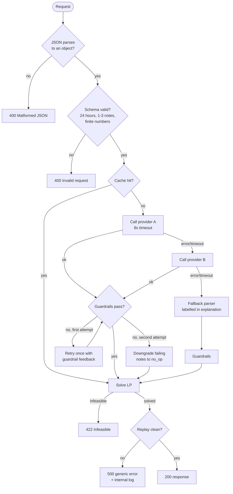
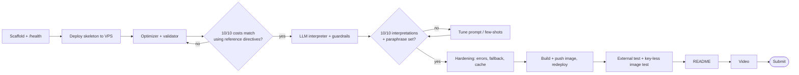

# 03 · Workflows

## 1. Request lifecycle (happy path)

```mermaid
sequenceDiagram
    autonumber
    participant J as Judge
    participant API as FastAPI
    participant RV as Request validator
    participant LLM as LLM interpreter
    participant GR as Guardrails
    participant OPT as LP optimizer
    participant VAL as Replay validator

    J->>API: POST /optimize-energy
    API->>RV: parse + validate body
    RV-->>API: Scenario (hours sorted 0..23)
    API->>LLM: notes + battery capacity
    LLM->>LLM: cache lookup (hash of notes + capacity)
    LLM->>LLM: 1 provider call, temp 0, JSON mode
    LLM->>GR: intermediate items (untrusted)
    GR-->>LLM: problems? → one retry with feedback
    GR-->>API: final directives (one per note, in order)
    API->>OPT: hours, battery, directives
    OPT-->>API: hourly_plan + totals
    API->>VAL: replay plan against directives
    VAL-->>API: [] (no violations)
    API-->>J: 200 JSON
```

Typical latency budget: validation < 5 ms · LLM 0.5–3 s · guardrails < 1 ms · LP ~3 ms · replay < 1 ms.

## 2. Decision flow, including failure paths



Status-code policy:

| Situation | Code | Body |
|---|---|---|
| Not JSON, or JSON is not an object | 400 | `{"error":"Malformed JSON body"}` |
| Wrong/missing fields, not 24 hours, empty note, NaN, negative | 400 | `{"error":"Invalid request: <field>: <reason>"}` |
| Valid request, LP infeasible | 422 | `{"error":"Scenario is infeasible ..."}` |
| Any unexpected exception | 500 | `{"error":"Internal error"}` — no stack trace |
| LLM down | **200** | normal response; fallback noted in `explanation` |

## 3. Guardrail workflow per note

1. `note_index` is an int within range and not already seen → else record problem.
2. `directive_type` ∈ the six allowed values → else `no_op`.
3. `no_op` → `applies=false`, adjustment `null`. Stop.
4. Build `hours` from `start_hour`/`end_hour` (inclusive/exclusive, 24 = midnight, wrap if end ≤ start, unique, ascending, non-empty).
5. Type-specific numbers: factor ∈ [0,1]; reserve ∈ [0, capacity]; grid cap ≥ 0; all finite.
6. Emit exactly the required keys for that type; `applies=true`.
7. Any missing note index is filled with a `no_op` entry so the output always has N entries in order.

## 4. Development workflow (the night itself)



Inner loop while tuning the prompt:

```bash
uvicorn app.main:app --reload --port 8000
python tests/run_samples.py http://localhost:8000 tests/public_samples.json
```

Commit after every green run. Small commits also help if judges inspect the repo history.

## 5. Test workflow

| Layer | How | Pass condition |
|---|---|---|
| Math | Feed reference directives straight into `optimize()` + `replay()` | cost diff ≤ 0.01, zero violations, 10/10 |
| Guardrails | Hand-written bad items: unknown type, hour 25, factor 1.4, reserve > capacity, duplicate index, non-list output | all become `no_op`, no exception |
| Interpretation | `run_samples.py` + `paraphrases.json` | type, hours, values equal |
| Contract | curl with: invalid JSON, `[]`, 23 hours, duplicate hour, empty note, 4 notes, `NaN` | 400 each, JSON body |
| Resilience | Unset `LLM_API_KEY`; set a wrong key; point `LLM_BASE_URL` at a dead host | still 200, fallback label present, < 30 s |
| Load | 10–20 parallel requests (`xargs -P` or `hey`) | no 5xx, p95 < 5 s |
| External | Run the sample runner against the public HTTPS URL from another network | same results as local |

## 6. Release workflow

```bash
# 1. build + tag
docker build -t ghcr.io/<user>/gridwise:1.0.0 .
# 2. key-less smoke test (this is what the judge's Docker check does)
docker run --rm -d -p 8000:8000 --name gw ghcr.io/<user>/gridwise:1.0.0
curl -s localhost:8000/health && docker stop gw
# 3. publish (make the package public in registry settings)
docker push ghcr.io/<user>/gridwise:1.0.0
# 4. deploy
ssh vps 'cd /opt/gridwise && docker compose pull && docker compose up -d'
# 5. verify from outside
python tests/run_samples.py https://gridwise.<domain> tests/public_samples.json
```

If you rebuild after a fix, bump the tag (`1.0.1`) and update the README — the submitted reference must point to an image that actually contains the final code.

## 7. Submission workflow

1. Endpoint base URL verified from a phone on mobile data.
2. Image reference with exact tag, pullable while logged out (`docker logout && docker pull ...`).
3. README complete; no secrets (`git grep -iE "sk-|api_key=.+"`).
4. Video link opens in an incognito window; length ≤ 3:00.
5. Submit. After the deadline: flip the repository to **public**. Keep VPS, image and video up through the judging window.
